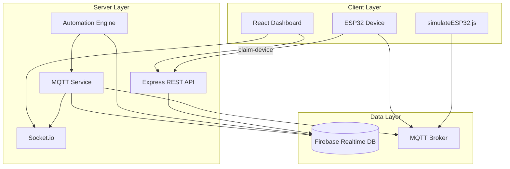
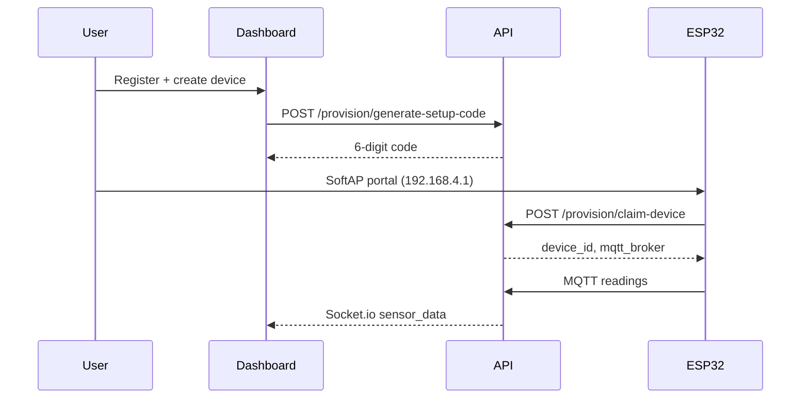

# AEMS Architecture

## System Overview



## Components

### Frontend (`aems-frontend`)

- React 19 + Vite
- JWT auth stored in `localStorage`
- Socket.io for live readings, alerts, device status
- Pages: Dashboard, Devices, Rooms, Alerts, Analytics, Settings

### Backend (`aems-backend`)

- Express 5 REST API on port 5000
- Firebase Admin SDK for persistence
- MQTT client subscribes to `aems/+/readings`, `aems/+/status`
- Automation engine (10s cycle): empty-room shutdown, after-hours, voltage protection
- Scheduler: daily summary (20:00), monthly reports (Africa/Douala)

### Firmware (`aems-firmware`)

- ESP32 with SoftAP provisioning portal
- PZEM-004T energy meter, 4 relay outputs, 1 PIR sensor
- NVS stores WiFi, device_id, business_id, MQTT broker

## MQTT Topics

| Topic | Direction | Payload |
|-------|-----------|---------|
| `aems/{deviceId}/readings` | Device → Backend | voltage, power, kWh, rooms, relays |
| `aems/{deviceId}/status` | Device → Backend | online/offline |
| `aems/{deviceId}/commands` | Backend → Device | `{ relay_id, status: "ON"\|"OFF" }` |

## Firebase Schema

```
users/{userId}
businesses/{businessId}
  └── settings (kWh limits, voltage thresholds, closing time)
devices/{deviceId}
device_setup/{deviceId}        # 6-digit provisioning codes
rooms/{businessId}/{roomId}    # relay_id, device_id, occupied, auto_shutdown
readings/{businessId}/{Y}/{M}/{D}/{timeKey}
alerts/{businessId}/{alertId}
```

## Provisioning Flow



On successful claim, the ESP32 becomes available for that business. Rooms are created by the user and linked to the ESP32/floor plus a relay identifier, so dashboards display business room names instead of relay placeholder names.

## Correct Operational Flow

1. Business owner registers and creates one or more ESP32 controllers.
2. Dashboard generates a 6-digit setup code for the selected ESP32.
3. The user enters that code in the ESP32 setup portal or simulator.
4. ESP32 claims the code, receives `device_id`, `business_id`, MQTT settings, and starts telemetry.
5. The user creates rooms and assigns each room to an ESP32, floor/area, relay identifier, and device type.
6. MQTT readings update the matching room using `business_id + device_id + relay_id`.
7. PIR motion sets the room state to occupied/ON and updates `last_motion`.
8. When PIR reports no motion, `empty_since` is set once. If the room stays empty for 3 minutes and auto-shutdown is enabled, the automation engine sends an OFF command to that room's ESP32 relay.

## Key API Routes

| Method | Path | Auth | Purpose |
|--------|------|------|---------|
| POST | `/api/provision/generate-setup-code` | Yes | Create 6-digit code |
| POST | `/api/provision/claim-device` | No | ESP32 provisioning |
| GET | `/api/provision/status/:deviceId` | Yes | Poll connection state |
| POST | `/api/provision/reset-device/:deviceId` | Yes | Re-pair device |
| GET | `/api/readings/live` | Yes | Latest business reading |
